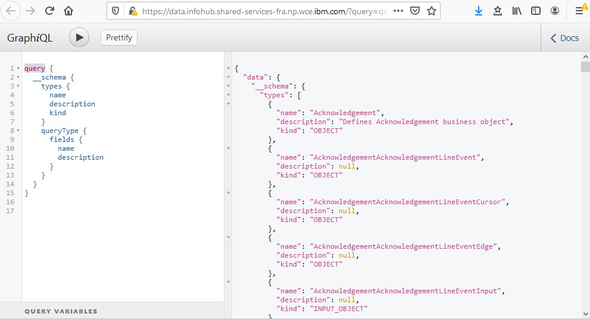
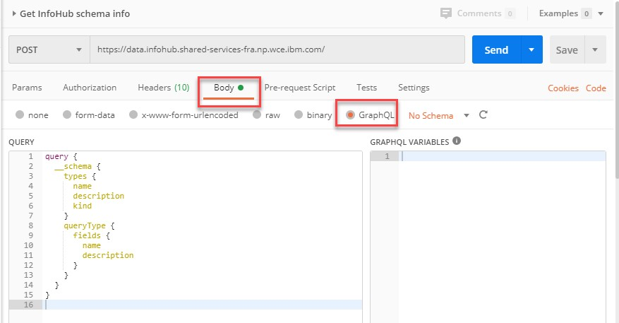
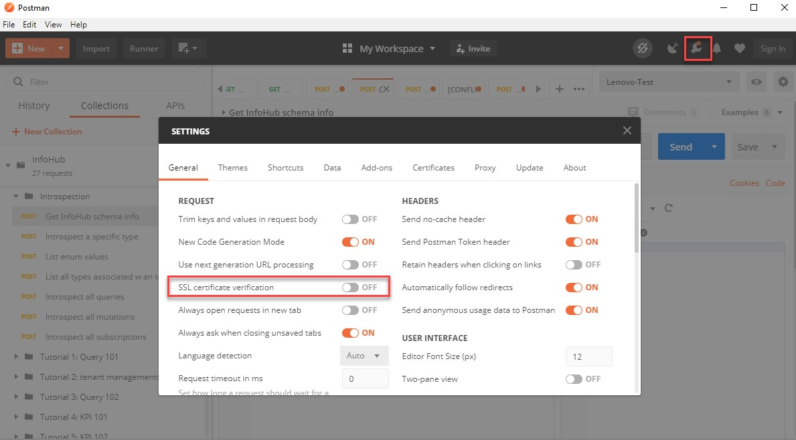
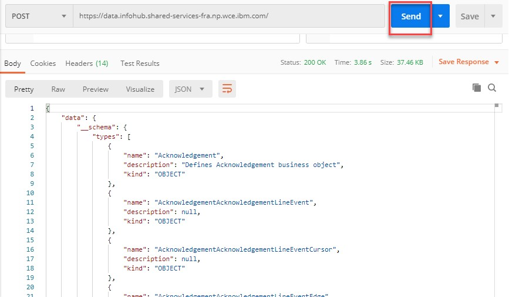

# Tutorial GraphQL Schema Introspection 101 

This tutorial was first published on May 5, 2020.

## Tutorial Overview

GraphQL is a query language based on a type system. GraphQL types define what objects are supported, what fields are associated with an object, and what can be queried and how, all defined by the GraphQL schema. To be able to use GraphQL APIs effectively, it is essential to have a good understanding of the InfoHub schema. 

Although the InfoHub GraphQL schema can be accessed through the [GitHub repo](https://github.ibm.com/SC-Shared-Services/infohub-graphql-server-base/blob/master/src/main/resources/schema.graphqls), there is another way to get information on the schema from the live system: using GraphQL Introspection. Schema introspection can be a very handy tool whenever you have a question about any part of the schema, such as what objects are defined, what fields are associated with a type, what are the values of an enumeration, what kind of queries are supported, and what parameters can be used for a query, etc.

## What you will learn

At the end of this tutorial, you will learn:

* How to find all the supported types (objects, interfaces, enum, etc.)
* How to find more details of each type (such as fields for an object, or values of an enum)
* What queries are supported, and query details (such as parameters)
* What mutations are supported
* How to construct a GraphQL query based on introspection results

## Pre-reqs

* If you are new to GraphQL, please complete the [graphql.com tutorial](https://www.graphql.com/tutorials/) until you feel comfortable with GraphQL API basics.
* Currently, you must be on the [P2PaaS Rex VPN](https://w3-connections.ibm.com/wikis/home?lang=en#!/wiki/W0c5faf15eabc_42d9_b877_4c8edce9bb37/page/IBM%20Sterling%20REX%20VPN) to access some of the APIs listed below. (Some of these APIs will likely have public APIs at a later date)
* It is recommended to have HTTP tool such as [Postman](https://learning.postman.com/docs/postman/launching-postman/installation-and-updates/) installed, so you can save the work you do in this tutorial, and reuse them later to help with other tutorials.

## Steps

1. Complete all pre-reqs and logon to the P2PaaS Rex VPN.

2. Introspect all types defined in the schema in GraphQL visual editor
  * Navigate to the GraphiQL visual editor by entering the following URL in a browser:
  ```
  https://data.infohub.shared-services-fra.np.wce.ibm.com/
  ```
   * Paste the following GraphQL query into the left side of the editor, and click the run button on the top left side of the editor. 
   ```
  query {
    __schema {
	    types {
		  name
		  description
		  kind
		}
		queryType {
		  fields {
			name
			description
		  }
		}
      }
    }
   ```
  * Once the query is completed, you will see the query response on the right side of the editor. Look through the response, and find some examples of OBJECT, INTERFACE, and ENUM. OBJECT types are the bread and butter of GraphQL APIs. Each OBJECT has fields which expose data and maybe queried by name. INTERFACEs are list of fields which may be implemented by OBJECT types. ENUM types are sets of discrete values. We will use some of them in later exercises. 
  
  * Navigate to the botton of the response, and check out the list of queries supported. We will do more query introspection in a later step.
  * In GraphiQL editor, one can also use the <Docs> link on the top right corner to inspect the schema definition. 

3. Run the same GraphQL schema query in Postman.
  * Open Postman, start a new request, name it `Get InfoHub schema info`.
  * Select POST from the drop down, and enter the following into the URL box: 
  ```
  https://data.infohub.shared-services-fra.np.wce.ibm.com/
  ```
  * In the request body section, select `GraphQL`, and copy and paste the same query from previous step into the QUERY box: 
   
  * Disable SSL certificate verification in Postman (you only need to do this once): 
   
  * Click Send, and you should see the response in the Response section below the request: 
    
    The response should be identical to the one received in previous step. Some of the benefits of doing the query in Postman are that the request can be saved, reused, cloned, and shared with others. For the remaining steps, feel free to choose either GraphiQL editor or Postman.
   
4. __Introspection of type details__. In previous two steps, we learned how to find all types defined in the schema, but the query provided us very little information about each type. For example, we still don’t know what fields are defined for any object. We will learn how to 
get detailed information about each type in this step.
  * Enter the following query into the tool of your choice: 
  ```
    query {
	  __type(name: "BusinessObjectsCursor") {
		...FullType
	  }
	}

	fragment FullType on __Type {
	  kind
	  name
	  description
	  fields(includeDeprecated: true) {
		name
		description
		args {
		  ...InputValue
		}
		type {
		  ...TypeRef
		}
		isDeprecated
		deprecationReason
	  }

	  inputFields {
		...InputValue
	  }

	  interfaces {
		...TypeRef
	  }

	  enumValues(includeDeprecated: true) {
		name
		description
		isDeprecated
		deprecationReason
	  }

	  possibleTypes {
		...TypeRef
	  }
	}

	fragment InputValue on __InputValue {
	  name
	  description
	  type {
		...TypeRef
	  }
	  defaultValue
	}

	fragment TypeRef on __Type {
	  kind
	  name
	  ofType {
		kind
		name
		ofType {
		  kind
		  name
		  ofType {
			kind
			name
			ofType {
			  kind
			  name
			  ofType {
				kind
				name
				ofType {
				  kind
				  name
				  ofType {
					kind
					name
				  }
				}
			  }
			}
		  }
		}
	  }
	}

  ```
  * Examine the response received:  `BusinessObjectsCursor` is an OBJECT type, which implements INTERFACE `Cursor`. It has three fields defined, `edges`, `pageInfo`, and `totalCount`. Field `edges` is a LIST of OBJECT `BusinessObjectEdge`, etc.  Knowing the INTERFACE can help to streamline queries with different OBJECT types in the responses.  
  